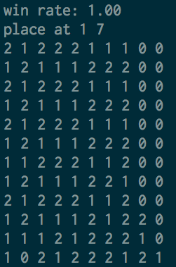

# 四子棋实验

## 实验目标

编写一个四子棋的AI，能够在限定时间内进行决策，通过自动对战对 AI 的水平进行测试。

## 目录结构

- Compete: 助教提供的命令行对战客户端
- Report: 实验报告
- Strategy: AI 代码目录
- UI: 助教提供的基于 .NET 的界面对战客户端
- Testcases: 助教提供的测试 AI
- Tests: 本机上与测试 AI 对战的结果

主要代码在 Strategy 目录下，Tests 目录下记录了对战结果。

## 测试平台

由于只提供了 32bit 的 macOS 上的二进制问卷，选择了一台比较老的机器，配置如下：

- MacBookAir Early 2015
- CPU: Intel Core i5-5250U @ 1.60GHz
- OS: macOS 10.13.6 17G6030
- Kernel: x86_64 Darwin 177.0

本机性能比较低，所以最终AI的对战结果可能和在助教机器上测得结果不同。

## 算法思路

在 Strategy 目录下实现的算法是信息上限树算法（UCT），基本按照如下伪代码对照实现，另外做了一些针对四子棋的优化。伪代码如下：

```
    function UCTSEARCH(S_0)
        以状态s_0创建根节点v_0;
        while 尚未用完计算时长 do:
            v_l←TREEPOLICY(v_0);
            ∆←DEFAULTPOLICY(s(v_l));
            BACKUP(v_l,∆);
        end while
        return a(BESTCHILD(v_0,0));

    function TREEPOLICY(v)
        while 节点v不是终止节点 do:
            if 节点v是可扩展的 then:
                return EXPAND(v)
            else:
                v← BESTCHILD(v,c)
            return v

    function EXPAND(v)
        选择行动a∈A(state(v))中尚未选择过的行动
        向节点v添加子节点v'，使得s(v')= f(s(v),a),a(v')=a
        return v'

    function BESTCHILD(v,c)
        return 〖argmax〗_(v'∈children of v) ((Q(v'))/(N(v'))+c√((2ln(N(v)))/(N(v'))))

    function DEFAULTPOLICY(s)
        while s不是终止状态 do:
            以等概率选择行动a∈A(s)
            s←f(s,a)
        return 状态s的收益

    function BACKUP(v,Δ)
        while v≠NULL do:
            N(v)←N(v)+1
            Q(v)←Q(v)+∆
            ∆←1-∆
            v←v的父节点
```

大概思路就是，首先通过一定的策略找到一个需要扩展的节点，然后从这个节点开始随机模拟一次对战，把这次对战的结果更新到从这个新节点到根节点的路径上。

搜索到一定思考时间后，选择根节点中胜率最高的子节点，作为 AI 目前的决策。

## 算法实现

### UCTSEARCH

代码在 `UCT.cpp` 中 `UCT::Search` 中。这个函数初始化棋盘，然后不断循环进行节点的扩展、模拟和更新，直到时间耗尽。

每次循环中，通过 `treePolicy` 找到需要扩展的节点，然后调用 `defaultPolicy` 得到一次模拟的胜率，通过 `backup` 来把这一次模拟的数据更新到这个节点到根节点的路径。

其中时间的获取通过 `gettimeofday` ，目前参数采用的是 2.9s ，即只要计算超过 2.9s 就停止。

最后从根节点中选择一个胜率最高的子节点，然后释放内存并退出。

### TREEPOLICY

代码在 `UCT.cpp` 的 `UCT::treePolicy`中。这个函数的功能是从根节点往下找到一个需要扩展的节点。如果当前节点是终止节点，就停止；否则要么扩展出新的一个节点，要么从已有的子节点中选择一个权值最高的节点。

### EXPAND

在 `UCTNode::expandOne` 中实现。它随机选取一个可以下的位置，新建一个新的节点并且返回。

### BESTCHILD

实现在 `UCTNode::bestChild` 函数中。它找出子节点中权值最高的那一个并且返回。这个函数兼任了两个功能，一个是 treePolicy 中的选择，一个是根节点寻找胜率最高的节点。

这里权值的选取就是 UCB 算法中上限信心索引的计算公式 `I_j = X_j + \sqrt{\frac{2ln(n)}{T_j(n)}`。实际在使用的时候，需要加一个权值，代码中使用的是 1.0 。

对于寻找根节点的最优子节点的时候，总会出现本来只剩一步就可以胜利了，但在必胜的时候仍然在其它地方下子，这样会很浪费评测的时间。于是在遇到必胜策略的时候，优先选择直接胜利的那一步。这在对战很弱的对手的时候有较好的效果。

早就必胜还在为难对手的例子：



### DEFAULTPOLICY

代码在 `UCT::defaultPolicy` 中。它实现功能是，从当前节点开始，模拟一场对局。按照原来的解法，这里是每一步都随机直到最后决出胜负。但是实践上出现了问题。

最突出的问题就是会突然“暴毙”，特别是到了接近结尾的时候。仔细研究了以后发现，由于棋盘接近下慢，出现的可能性很小了，有的情况下，按照胜率计算并不准确，例如 67% 的胜率是在对方有三个位置可以走，两个输一个赢的情况下算出来的，但对方不傻，一定会选择赢的那一种，所以这个时候计算的胜率不再正确。为了解决这个问题，在模拟的时候，进行了一步必胜的考虑，分为以下情况：

- 如果己方下某一个位置就可以获胜，那么直接按照胜利处理。
- 如果上一条不成立，但对方下两个或以上位置都可以胜利，那么直接按照失败处理。
- 如果己方下了某一个位置没有获胜，但对方可以立即在同一列上下子获胜，那么直接按照失败处理。

通过这些策略，“暴毙”的情况得到了一定的减少。

### BACKUP

实现在 `UCTNode::backup` 中。它的功能就是从当前节点向上走，不断更新模拟的总数量和胜率。由于双方是交替下棋，所以胜率要在0和1之间交替计算。

这样就可以把整棵树的胜率计算出来了。

## 对战结果

通过运行 `Compete` 将编写的 AI 和若干个 Testcase 进行了对打。评测结果都通过 `make compete opponent=xxx` 运行得到，输出写到 `Tests` 目录下。文件命名 `test-A-100` 代表编写的 AI 作为 A 方与 100 号 Testcase 对战的结果。由于每次对战都要花很多时间，所以得到的结果比较少。

最后得到了如下的并不精确的胜率数据：

| 测试样例 | 作为A方的胜场/总场 | 作为B方的胜场/总场 |
| -------- | ------------------ | ------------------ |
| 2        | 2/2                | 2/2                |
| 10       | 10/10              | 10/10              |
| 50       | 2/2                | 2/2                |
| 80       | 3/10               | 4/10               |
| 90       | 1/2                | 1/2                |
| 94       | 1/2                | 1/2                |
| 96       | 0/2                | 1/2                |
| 98       | 7/20               | 6/20               |
| 100      | 7/20               | 9/20               |


## 后续改进

对 UCT 的改进主要有两个方面，一个是提高速度，增加模拟的次数，这可以通过优化一些耗时的操作来达到，例如用位运算来进行胜利条件的判断，用内存池代替 new 和 delete 等等；另一个是优化 `defaultPolicy` 的剪枝，把一些显而易见的最优步骤直接计算出来，这样可以减少上面见到的“暴毙”的问题。

当然了，也可以换别的算法来实现这个 AI ，例如用非常优秀的评价函数来写 Minimax 算法等等。

## 2025 更新

建议阅读：https://github.com/zhc7/ConnectFour/，里面有很多值得参考的思路。

2025 年，闲着无聊把当年 2019 年的代码交到 Saiblo 平台上测试，和 50 个 AI 评测只有 78% 的胜率，发现有点低，所以做了一些调试。称这个版本为 v1。

首先是发现，在一步就可以胜利的局面下，没有选择胜利的那一步，而是选了别的，然后走着走着就输了，因此添加了一个单步胜利的检查，胜率提升到了 80%。称这个版本为 v2。

进一步做测试，发现单步胜利的问题解决了，但是在需要两步才能胜利的时候，经常找不到必胜的策略，同时对于必胜的局面，还可能搜出来一个非 100% 胜率的结点，于是进一步调试，发现有两个问题：一是计算结点的分数 Q 的时候，用的是浮点类型，累加的时候可能会有精度损失，考虑到它只能是 0/0.5/1，所以用 int 记录它的两倍，然后计算浮点的时候再除以二，这样就保证精确了；二是判断结点是否为终止结点的时候，判断的时机问题，有可能在错误的局面下进行了判断，导致结果错误。修复了这些问题后，胜率就提高到了 92%。称这个版本为 v3。

然后发现在接近残局的时候，如果当前下棋的一方有单步胜利，就不要再进行随机的 expand，而是可以直接转换为 end node，避免单步胜利的那一方，因为随机下棋而导致胜率比实际要低。修复了以后，胜率提高到了 97%。称这个版本为 v4。

接着优化搜索性能：使用 BitBoard 方式加位运算来加速胜利条件的判断，根据 perf 汇报的热点做了一些小优化。称这个版本为 v5。

然后观察到这个 AI 在残局的时候，搜不到比较深的必胜/必败局面，此时引入一个优化：如果一个结点的子结点有至少一个必胜结点，那么这个结点一定是一个必败结点；类似地，如果一个结点的子节点都是必败结点，那么这个结点一定是一个必胜结点。把这个信息递归地在树上传播，可以更快地推导出必胜/必败局面。称这个版本为 v6。

接着，考虑到 AI 是在之前的基础上在同一个进程内继续执行的，所以可以利用上一步留下来的搜索树的一部分，找到这一回合下子对应的结点，作为新的根结点，节省搜索时间。称这个版本为 v7。

进一步做优化：当对方还剩一步就可以胜利的时候，己方必须在那一步的位置下子，这个逻辑不仅可以用于随机游走部分，还可以用于扩展子结点步骤：在扩展子结点时，如果有这种情况，就不需要再扩展其他结点了。称这个版本为 v8。

在 v8 的基础上，把时间限制放松到 2.95s，得到 v9 版本。进一步改进搜索性能，针对小棋盘的情况，减少移位的次数，得到 v10 版本。针对 AI 在遇到必败的情况下随便下棋的情况，统计了必胜和必败条件下到达最终局面的最多步数，然后在必胜的时候选择步数最少的那一个，在必败的时候选择步数最多的那一个，这样 AI 可以撑得更久，当对手比较弱的时候，有更多翻盘的机会。称这个版本为 v11。v12 在 v11 的基础上修复了最多步数的计算错误。

自己写了一个类似 Saiblo 的随机对战工具，但是运行在本地，对这些 AI 做了强弱的比较，结果如下：

- v1-v2: 胜率在 10-20% 之间，ELO 在 700 分左右
- v3-v7: 胜率在 40-60% 之间，ELO 在 1000 分左右
- v8-v12: 胜率在 70-80% 之间，ELO 在 1200 分左右

v11 版本在 Saiblo 排行榜上最高观察到第 11 名，1319 分。

可见最重要的优化，就是：保证几步以内的必胜或必败局面可以正确地算出来并走出来；在树上进行剪枝。

接着，参考论文进行了改进：首先添加了 First Step Urgent 的逻辑，即刚 expand 出来的结点，之后优先再 expand 一次，而不是去 expand 图的兄弟结点，称这个版本为 v13。

进一步阅读论文，[发现可以用图来代替树，从而复用结点](https://github.com/lightvector/KataGo/blob/master/docs/GraphSearch.md)，因此对代码进行了大量修改，得到一个基于有向无环图的实现。称这个版本为 v14。

但这个实现的内存回收比较难做，不做回收会 OOM，因此先做了一个每 n 回合清理所有缓存的结点的逻辑，但是这样缓存的效果比较差；后来改成引用计数法，把很早搜出来的一些局面丢弃掉。称这个版本为 v15。v15 虽然解决了内存回收的问题，但是复用的结点也变少了。在 v15 的基础上，去掉引用计数，改为扫描哈希表，把哈希表里面那些从当前局面不可达的结点释放掉（根据棋子数量以及是否存在某个位置有冲突），这样不会 OOM。称这个版本为 v16。由于遍历哈希表在平台上耗时太久，有时候要 0.3s，所以最后又做了一个基于 Bump Allocator 的版本 v17。

后面这几个版本的胜率有略微的提升，但不是特别大。
